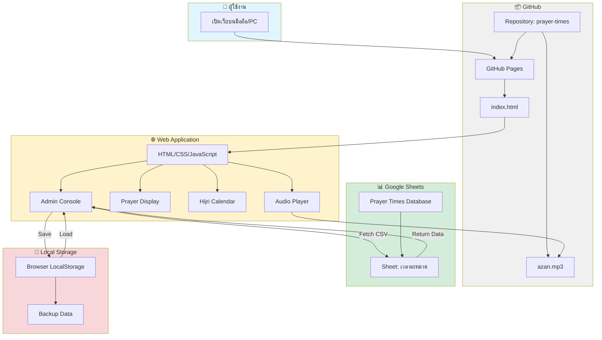
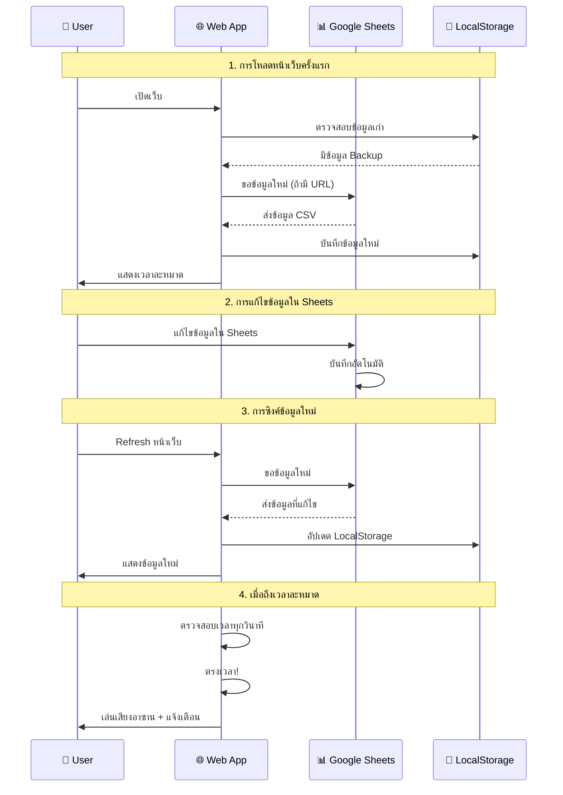
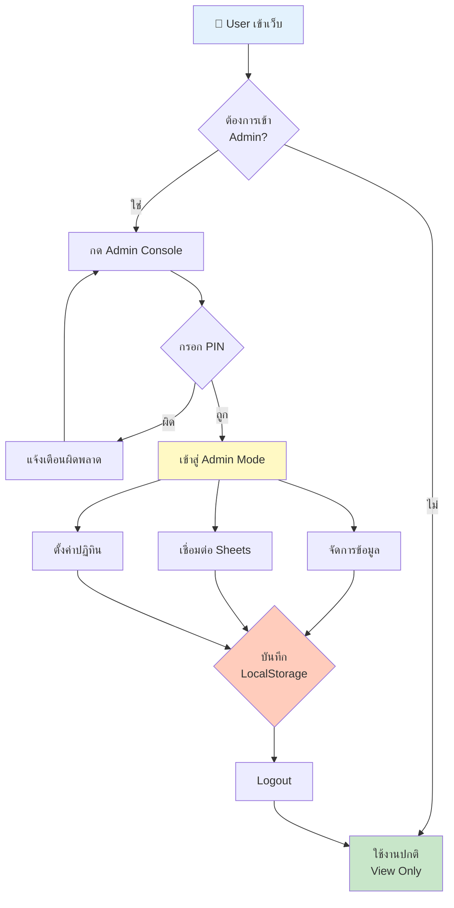
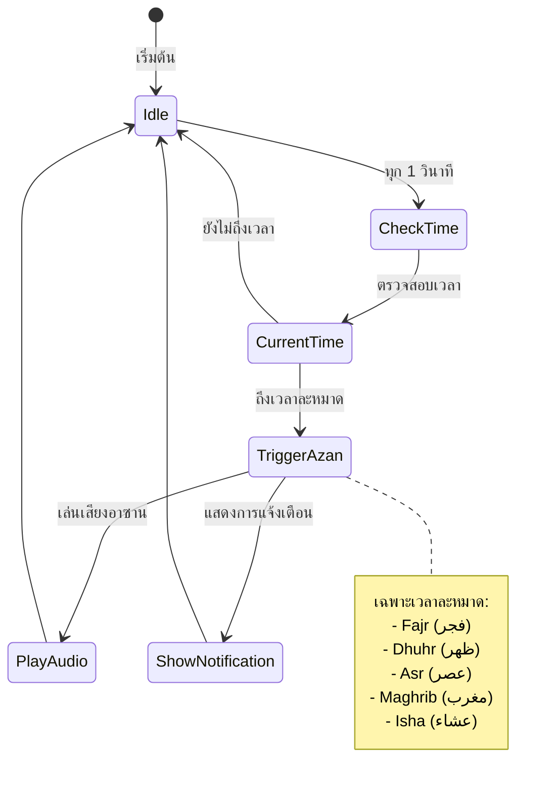

# 📐 System Architecture - สถาปัตยกรรมระบบ

## 🗺️ แผนผังโครงสร้างระบบ



---

## 🔄 Data Flow - การไหลของข้อมูล



---

## 🏗️ Component Structure - โครงสร้างส่วนประกอบ

```mermaid
graph LR
    subgraph WebApp["🌐 Islamic Prayer Times App"]
        direction TB
        
        subgraph Header["📱 Header Section"]
            H1[Date Display<br/>วันที่ฮิจเราะห์]
            H2[Live Clock<br/>นาฬิการันจริง]
            H3[Location Selector<br/>เลือกพื้นที่]
        end
        
        subgraph MainCard["⭐ Active Prayer Card"]
            M1[Current Prayer<br/>เวลาละหมาดปัจจุบัน]
            M2[Countdown Timer<br/>นับถอยหลัง]
            M3[Glowing Effect<br/>เอฟเฟกต์แสง]
        end
        
        subgraph Grid["🔢 Prayer Grid"]
            G1[Prayer 1<br/>เวลาอื่นๆ]
            G2[Prayer 2]
            G3[Prayer 3]
            G4[Prayer 4]
            G5[Prayer 5]
            G6[Prayer 6]
        end
        
        subgraph Calendar["📅 Hijri Calendar"]
            C1[Month Display<br/>แสดงเดือน]
            C2[Date Grid<br/>ตารางวัน]
            C3[Today Highlight<br/>ไฮไลท์วันนี้]
        end
        
        subgraph Admin["👨‍💼 Admin Console"]
            A1[PIN Entry<br/>กรอก PIN]
            A2[Sheets Sync<br/>เชื่อมต่อ Sheets]
            A3[Data Management<br/>จัดการข้อมูล]
            A4[Hijri Settings<br/>ตั้งค่าปฏิทิน]
        end
    end
    
    Header --> MainCard
    MainCard --> Grid
    Grid --> Calendar
    Calendar --> Admin
    
    style Header fill:#e3f2fd
    style MainCard fill:#fff9c4
    style Grid fill:#f3e5f5
    style Calendar fill:#e8f5e9
    style Admin fill:#fce4ec
```



---

## 🔐 Security & Access Control



---

## 📊 Google Sheets Structure

### ตารางข้อมูลมาตรฐาน

| คอลัมน์ | ชื่อ | ประเภทข้อมูล | ตัวอย่าง | คำอธิบาย |
|---------|------|--------------|----------|----------|
| A | start_date | Date (YYYY-MM-DD) | 2026-03-01 | วันที่เริ่มต้นช่วงเวลา |
| B | end_date | Date (YYYY-MM-DD) | 2026-03-31 | วันที่สิ้นสุดช่วงเวลา |
| C | imsak | Time (HH:MM) | 04:55 | เวลาอิมซัก (หยุดกินก่อนฟัจญ์ร) |
| D | fajr | Time (HH:MM) | 05:10 | เวลาละหมาดฟัจญ์ร |
| E | sunrise | Time (HH:MM) | 06:28 | เวลาพระอาทิตย์ขึ้น (ชุรูก) |
| F | dhuhr | Time (HH:MM) | 12:30 | เวลาละหมาดซุฮร |
| G | asr | Time (HH:MM) | 15:45 | เวลาละหมาดอัศร |
| H | maghrib | Time (HH:MM) | 18:35 | เวลาละหมาดมัฆริบ |
| I | isha | Time (HH:MM) | 19:45 | เวลาละหมาดอิชา |

### ตัวอย่างข้อมูลที่ถูกต้อง

```
start_date,end_date,imsak,fajr,sunrise,dhuhr,asr,maghrib,isha
2026-01-01,2026-01-31,05:00,05:15,06:33,12:35,15:50,18:40,19:50
2026-02-01,2026-02-28,05:02,05:17,06:35,12:36,15:52,18:42,19:52
2026-03-01,2026-03-31,04:55,05:10,06:28,12:30,15:45,18:35,19:45
```

---

## ⚙️ Configuration Settings

### ค่าคงที่ที่สำคัญ

```javascript
// PIN สำหรับเข้า Admin
const PIN_CODE = "1785";

// ส่วนต่างเวลาตามพื้นที่ (นาที)
const OFFSETS = { 
    'ยะลา': 0,           // มาตรฐาน
    'นครศรีธรรมราช': 3,  // +3 นาที
    'จะนะ': 1,           // +1 นาที
    'สตูล': 2,           // +2 นาที
    'ตรัง': 4,           // +4 นาที
    'ปัตตานี': -2,       // -2 นาที
    'นราธิวาส': -4,      // -4 นาที
    'สุไหงโกลก': -5      // -5 นาที
};

// ข้อมูลการแสดงผลแต่ละเวลาละหมาด
const PRAYER_META = [
    { id: 'im', ar: 'إمساك', icon: 'clock', color: 'text-indigo-500' },
    { id: 'fa', ar: 'صبح', icon: 'sunrise', color: 'text-blue-400' },
    { id: 'sh', ar: 'شروق', icon: 'sun-medium', color: 'text-orange-400' },
    { id: 'dh', ar: 'ظهر', icon: 'sun', color: 'text-yellow-500' },
    { id: 'as', ar: 'عصر', icon: 'cloud-sun', color: 'text-amber-600' },
    { id: 'ma', ar: 'مغرب', icon: 'moon-star', color: 'text-red-500' },
    { id: 'is', ar: 'عشاء', icon: 'moon', color: 'text-purple-600' }
];
```

---

## 🎨 Design System

### Color Palette

- **Primary**: `#064439` (เขียวเข้ม - Islamic green)
- **Accent**: `#2e7d32` (เขียวสด)
- **Background**: `#f0f2f1` (เทาอ่อน)
- **Card**: `#ffffff` (ขาว)
- **Text Primary**: `#064439` (เขียวเข้ม)
- **Text Secondary**: `#6b7280` (เทา)

### Typography

- **Arabic Font**: Amiri (serif) - สำหรับภาษาอาหรับ
- **Thai Font**: Kanit (sans-serif) - สำหรับภาษาไทย
- **Weights**: 300, 400, 500, 600, 700

### Spacing Scale

- `xs`: 4px
- `sm`: 8px
- `md`: 16px
- `lg`: 24px
- `xl`: 32px
- `2xl`: 48px

---

## 🔔 Event System

### การตรวจสอบและแจ้งเตือน



---

## 📦 Technology Stack

### Frontend
- **HTML5** - โครงสร้างหน้าเว็บ
- **CSS3** + **Tailwind CSS** - การจัดรูปแบบ
- **Vanilla JavaScript** - Logic และ Functionality
- **Lucide Icons** - ไอคอนสวยงาม
- **SweetAlert2** - การแจ้งเตือนแบบ Modern

### Fonts
- **Amiri** (Google Fonts) - ภาษาอาหรับ
- **Kanit** (Google Fonts) - ภาษาไทย

### Hosting & Storage
- **GitHub Pages** - Web Hosting (ฟรี)
- **Google Sheets** - Database (ฟรี)
- **Browser LocalStorage** - Offline Backup

### Audio
- **HTML5 Audio API** - เล่นเสียงอาซาน
- **GitHub Raw Files** - เก็บไฟล์เสียง

---

## 🌟 Key Features

1. **Real-time Clock** ⏰
   - อัปเดตทุกวินาที
   - แสดงเวลาปัจจุบัน
   - นับถอยหลังถึงเวลาถัดไป

2. **Dynamic Prayer Cards** 📇
   - ไฮไลท์เวลาปัจจุบัน
   - เอฟเฟกต์แสงกระพริบ
   - แสดงไอคอนตามเวลา

3. **Hijri Calendar** 📅
   - แสดงปฏิทินอิสลาม
   - ไฮไลท์วันปัจจุบัน
   - แปลงวันที่อัตโนมัติ

4. **Multi-location Support** 🗺️
   - รองรับ 8 พื้นที่
   - ปรับเวลาอัตโนมัติ
   - ระบบ Offset แม่นยำ

5. **Automatic Azan** 🔊
   - เล่นเมื่อถึงเวลา
   - การแจ้งเตือนสวยงาม
   - รองรับทุก Browser

6. **Admin Dashboard** 👨‍💼
   - จัดการข้อมูลง่าย
   - UI/UX ระดับมืออาชีพ
   - ปลอดภัยด้วย PIN

7. **Google Sheets Integration** 📊
   - เชื่อมต่ออัตโนมัติ
   - ซิงค์ข้อมูลทุกอุปกรณ์
   - แก้ไขง่ายไม่ต้องแก้โค้ด

8. **Offline Support** 💾
   - LocalStorage Backup
   - ใช้งานได้แม้ Sheets ล่ม
   - ข้อมูลไม่สูญหาย

---

## 📈 Performance Optimization

### การโหลดหน้าเว็บ
- ✅ Preload Audio File
- ✅ Lazy Load Icons
- ✅ Minimal JavaScript Bundle
- ✅ Optimized CSS

### การจัดการหน่วยความจำ
- ✅ Single Page Application
- ✅ Efficient Event Listeners
- ✅ No Memory Leaks
- ✅ Clean State Management

### การเชื่อมต่อ Network
- ✅ Cache Google Sheets Data
- ✅ Fallback to LocalStorage
- ✅ CDN for Libraries
- ✅ Optimized API Calls

---

**เอกสารนี้สร้างโดย:** Islamic Prayer Times Project  
**อัปเดตล่าสุด:** 2026-02-22  
**เวอร์ชัน:** 2.0
